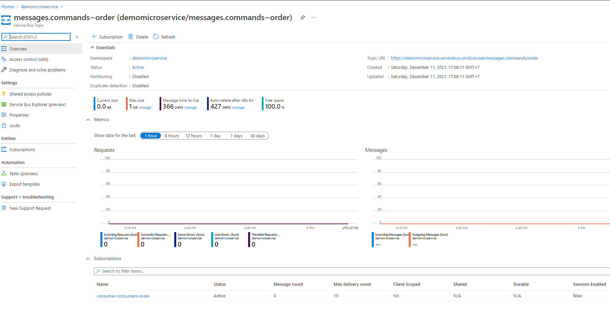
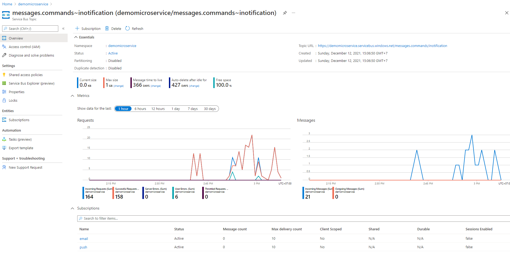
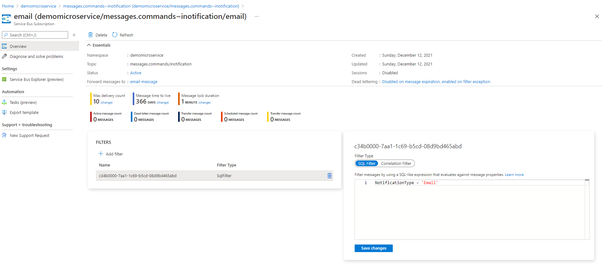

# NET5-Microservices-Using-MassTransit-AzureServiceBus
Example: Microservices using MassTransit via AzureServiceBus

    + RabbitMQ
        - Direct Queue(queue:consumer-consumers-order)
        - Exchange Topic: notification
            - Topic=email: will be received by EmailService
            - Topic=push: will be received by Notification

    + Azure Service Bus
        - Direct Queue(queue:consumer-consumers-order) and  Topic(messages.commands~order)
        - Topic=messages.commands~inotification


### Requirements
----------------
+ Install .NET5
+ Install Docker & Docker Compose
    - RabbitMQ Server Dashboard(http://localhost:15672/)
+ Create a account in Azure
    - Just a note, to use Azure Service Bus Topics, the "standard" pricing tier is required.

### Structures
----------------
+ Producer: using the API sends messages
+ Consumer: receive messages from Queue(consumer-consumers-order) and Topic(messages.commands~order)
+ NotificationService: receive messages with Topic=messages.commands~inotification, Subcription Filter: NotificationType = 'Push'
+ EmailService: receive message with Topic=messages.commands~inotification, Subcription Filter: NotificationType = 'Email'
+ Messages: create message model and Service Connection Config for RabbitMQ and Azure Service Bus


### Usages

#### RabbitMQ Server
-------------------
+ Start RabbitMQ Server
    ```
    cd DemoMicroservices
    docker-compose up
    ```

#### Azure Service Bus
----------------
+ Setting configs in appsettings.json
    ```
    "AzureServiceBus": "Endpoint=sb://[resource-name].servicebus.windows.net/;SharedAccessKeyName=RootManageSharedAccessKey;SharedAccessKey=xxxxxx"
    "UsingAzureServiceBus": "true",
    ```

+ Direct Queue:

    - Automatically create a topic(messages.commands~order) and subscription name(consumer-consumers-order). It will be direct to the consumer-consumers-order queue
    

+ Topic:

    - Automatically create a topic(messages.commands~inotification) and 2 subscription names(push and email). It will be direct messages to the `notification-message` and `email-message` queue respectively.

    - Topic
    

    - Subcription Filter
    

### Run
-------
+ Start multi apps with Visual Studio

+ Run Producer: http://localhost:22270/swagger/index.html
    + Send a message to Queue(consumer-consumers-order), Run post Order API
        ```
        http://localhost:22270/Order
        ```

    + Send a message to Email Service, run post Notification API
        ```
        http://localhost:22270/Notification

        {
            "notificationId": "3fa85f64-5717-4562-b3fc-2c963f66afa6",
            "notificationType": "Email",
            "notificationContent": "email body",
            "notificationAddress": "nhat.thai@example.com",
            "notificationDate": "2021-12-06T04:31:16.654Z"
        }
        ```

    + Send a message to Notification, run post Notification API
        ```
        http://localhost:22270/Notification

        {
            "notificationId": "3fa85f64-5717-4562-b3fc-2c963f66afa6",
            "notificationType": "Push",
            "notificationContent": "body",
            "notificationAddress": "",
            "notificationDate": "2021-12-06T04:31:16.654Z"
        }
        ```

### Issues
----------
+ [Azure Service Bus: Selecting basic tier doesn't seem to work](https://github.com/MassTransit/MassTransit/discussions/2947)

    ```
   SubCode=40000. The property 'AutoDeleteOnIdle' cannot be set when creating a Queue because the namespace 'demomicroservice' is using 'Basic' tier. To know more visit https://aka.ms/sbResourceMgrExceptions

    Parameter name: AutoDeleteOnIdle. TrackingId:2ce447ac-1cb0-4f01-a134-4b6470d70fce_G21, SystemTracker:demomicroservice.servicebus.windows.net:consumer-consumers-order, Timestamp:2021-12-11T03:57:34

    Status: 400 (Bad Request)

    ErrorCode: 40000
    ```

    Fixed:  the "standard" pricing tier is required.

### References
--------------
+ [RabbitMQ with ASP.NET Core – Microservice Communication with MassTransit](https://codewithmukesh.com/blog/rabbitmq-with-aspnet-core-microservice/)
+ [MassTransit a real use case](https://blexin.com/en/blog-en/masstransit-a-real-use-case/)
+ [Azure Service Bus Queue with MassTransit](https://dgtechboost.com/2020/06/26/azure-service-bus-queue-with-masstransit/)
+ [Azure Service Bus Topic with MassTransit](https://dgtechboost.com/2020/07/20/azure-service-bus-topic-with-masstransit/)
+ [Getting started with Azure Service Bus with MassTransit](https://chlee.co/getting-started-with-azure-service-bus-with-masstransit/)
+ [MassTransit Topology in Azure Service Bus](https://masstransit-project.com/advanced/topology/servicebus.html)
+ [MassTransit Subcription Filter](https://github.com/MassTransit/MassTransit/blob/master/tests/MassTransit.Azure.ServiceBus.Core.Tests/SubscriptionFilter_Specs.cs)